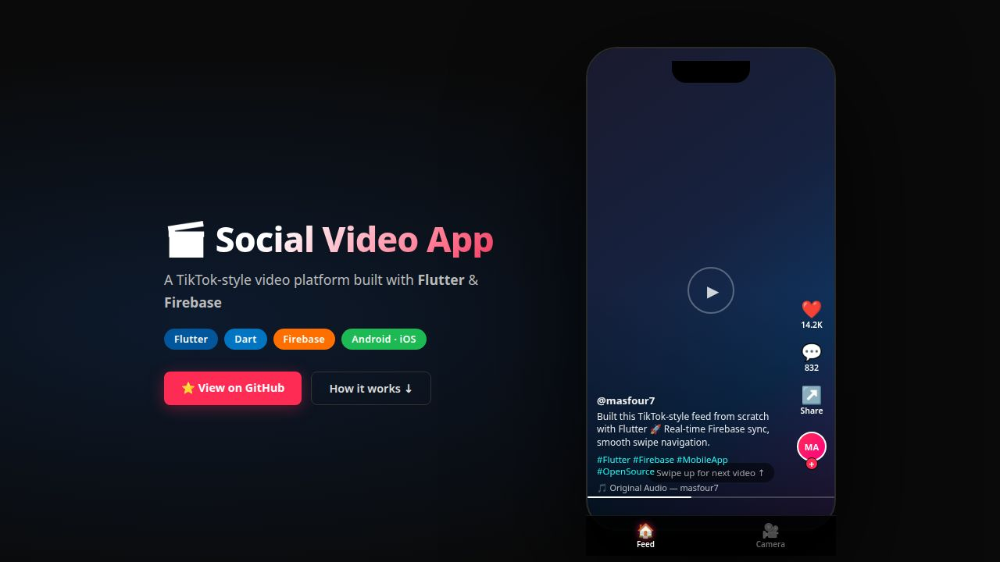

<div align="center">

# 🎬 Social Video App

### A TikTok-style vertical video platform built with Flutter & Firebase

[](#)
[](#)
[](#)
[](#)
[](LICENSE)
[](#-try-it-in-your-browser)

> **Record. Upload. Scroll.**
> A full-stack mobile video platform where videos are compressed on-device, uploaded to Firebase, and streamed in a real-time vertical feed — built entirely from scratch.



*Interactive demo running in the browser — a phone simulator showing the live video feed with like/comment/share actions, swipe navigation, and a camera screen with tap-to-photo and hold-to-record.*

</div>

---

## ✨ Try it in your browser

There's a **fully interactive web demo** in [`web-demo/`](web-demo/) that simulates the app's UI — no Flutter or device needed.

```bash
# from the repo root
cd web-demo && python3 -m http.server 5000
# then open http://localhost:5000
```

The demo renders a phone frame with the full video feed (swipe up/down or use arrow keys), a working camera screen with tap-to-photo and hold-to-record, gallery upload button, and like/comment animations. It's the same look and feel as the native app.

---

## 🎯 What it does

Social Video App is a native mobile application where users can:

1. **Record** a video by long-pressing the shutter (a circular progress ring tracks the recording time)
2. **Snap** a photo with a single tap
3. **Upload** an existing video from the gallery
4. **Watch** the video get compressed with FFmpeg before upload — saving bandwidth and storage
5. **See** the uploaded video appear live in every user's feed within seconds, powered by a Firestore real-time stream

The feed is a vertical `PageView` that snap-scrolls between videos, auto-plays on arrival, and lets the user tap to pause and resume — exactly like TikTok's core interaction model.

---

## 🧠 How it works

### Upload pipeline

```
User records / picks a video
        │
        ▼
video_compress (FFmpeg) → LowQuality output
        │
        ▼
Firebase Storage  ←  UUID as filename
        │
        ▼ download URL
Firestore  →  { url, creationDate, id: UUID }
        │
        ▼
All clients receive the new document via real-time stream
```

### Feed architecture

```
Firestore stream (orderBy creationDate desc)
        │
        ▼
StreamBuilder<QuerySnapshot>
        │
        ▼
PageView.builder  →  VideoItem  →  AppVideoPlayer
                                       │
                              VideoPlayerController.network(url)
                                       │
                               auto-play + tap-to-pause
```

### Camera state machine

```
IDLE  ──tap──►  PHOTO CAPTURED  ──next──►  UPLOAD
      │
      └─hold──► RECORDING ──release──► PREVIEW ──next──► UPLOAD
```

---

## 📂 Repository layout

```
.
├── lib/
│   ├── main.dart                   # Firebase init, routing, home scaffold
│   ├── screens/
│   │   ├── camera/
│   │   │   ├── sCamera.dart        # Discovers available cameras via availableCameras()
│   │   │   └── wCameraItem.dart    # Full camera UI — record, capture, preview, upload
│   │   └── videos/
│   │       ├── videosList.dart     # Real-time Firestore stream → vertical PageView
│   │       └── videoPlayer.dart    # Network VideoPlayerController with tap-pause
│   └── services/
│       └── storage.dart            # Compress → upload to Storage → return URL
├── web-demo/                       # Interactive browser demo (no install needed)
│   ├── index.html
│   ├── style.css
│   └── app.js
├── docs/images/                    # README screenshots
├── android/                        # Android project + google-services.json
├── ios/                            # iOS project + Runner
└── pubspec.yaml
```

---

## 🚀 Getting started

### Prerequisites

- [Flutter SDK](https://docs.flutter.dev/get-started/install) — stable channel
- Android Studio or Xcode
- A Firebase project with **Firestore**, **Storage**, and **Cloud Functions** enabled

### Setup

```bash
# 1. Clone
git clone https://github.com/masfour7/Social-Video-Streaming-App.git
cd Social-Video-Streaming-App

# 2. Install Flutter dependencies
flutter pub get

# 3. Add your Firebase config files
#    → android/app/google-services.json
#    → ios/Runner/GoogleService-Info.plist

# 4. Run on a connected device or emulator
flutter run
```

### Firebase configuration

Create a Firestore collection called `videos`. Each document has this shape:

```json
{
  "url": "https://firebasestorage.googleapis.com/...",
  "creationDate": "2024-01-15T10:30:00Z"
}
```

The document ID is the same UUID used as the Storage filename — so the two records always stay in sync.

> **Security rules:** Tighten Firestore and Storage rules before shipping to production. The app works with open rules during development.

---

## 🔌 Tech stack

| Layer | Technology | Version |
|-------|-----------|---------|
| Framework | Flutter | stable |
| Language | Dart | ≥ 2.7.0 |
| Real-time DB | Cloud Firestore | — |
| File storage | Firebase Storage | — |
| Server-side | Cloud Functions | — |
| Video playback | video_player | ^0.10.11+2 |
| Compression | video_compress | ^2.0.0 |
| Camera | camera (custom fork) | DealerPeak/plugins |
| File picker | file_picker | ^1.13.0 |
| State | Provider | ^4.0.4 |
| IDs | uuid | ^2.2.0 |

> The camera plugin uses a [custom fork](https://github.com/DealerPeak/plugins/tree/camera-fix-android-audio) that fixes audio recording on Android.

---

## 🛠 Notable implementation details

**On-device compression before upload** — `StorageServices.compressVideoFile()` runs FFmpeg via `video_compress` at `VideoQuality.LowQuality` before touching the network. This keeps upload times short and streaming smooth even on mobile connections.

**UUID-linked records** — A single `Uuid().v1()` call produces the ID used for both the Storage path (`videos/posts/<uuid>`) and the Firestore document ID. There's never a mismatch between the two.

**Custom camera fork** — The upstream `camera` plugin had a known bug where audio wasn't captured on certain Android devices. The `camera-fix-android-audio` branch from DealerPeak/plugins resolves this without waiting for an upstream merge.

**Real-time feed** — `VideosListScreen` subscribes to a Firestore `snapshots()` stream. When any user uploads a video, every open instance of the feed receives the new document automatically — no polling, no manual refresh.

---

## 📄 License

MIT © [Mohammad Asfour](https://github.com/masfour7)
